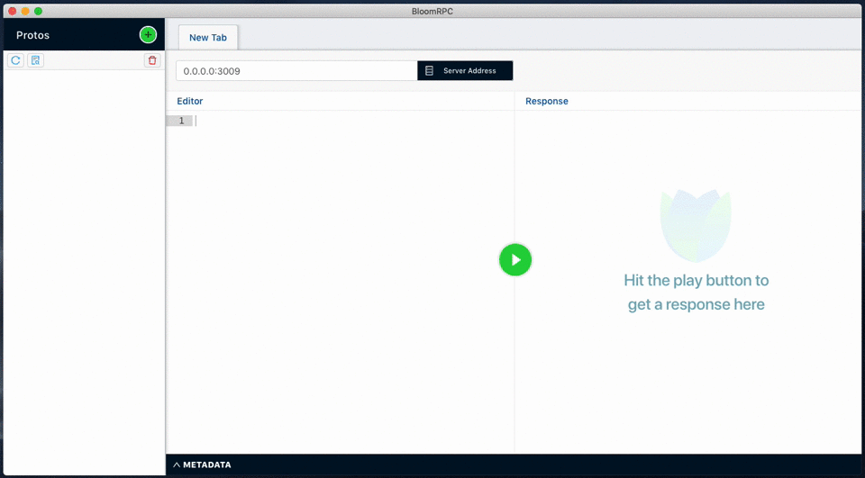
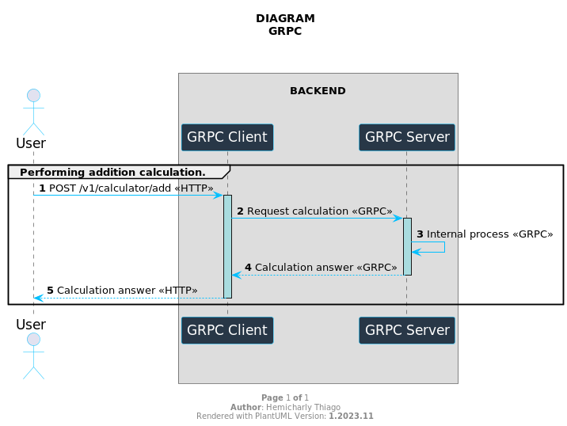

# GRPC SPRING BOOT 3.2.x


This project has educational purposes, aiming to understand how gRPC works with Spring Boot. We implemented a simple calculator example, focusing on the core functionality. We chose to use the latest versions of dependencies, ensuring compatibility, and exploring the latest available features.

Throughout the development process, we paid special attention to error handling to enhance system robustness. We explored effective strategies for dealing with unexpected situations, ensuring a more reliable user experience. Additionally, we implemented detailed log tracing between applications, providing a clearer and more granular view of the execution flow.

By sharing this knowledge, we hope to contribute to a deeper understanding of some recommended practices when integrating gRPC with Spring Boot, offering valuable insights for developers looking to enhance their skills in this specific context.

## Keywords
*Keywords*: gRPC, Spring Boot 3, Java 17, Micrometer, Tracer, RESTful, Microservices.


### 1. Required requirements

- Install Java 17
- Install Maven 3.6.3

### 2. Dependency versions

- *springframework.boot*: **3.20.0**
- *org.springdoc*: **2.3.0**
- *io.grpc*: **1.6.0**
- *io.lombok*: **1.18.30**
- *org.mapstruct*: **1.5.5.Final**
- *io.micrometer*: **compatible spring boot 3.2.0**

### 3. Running the applications

* install dependencies

    ```bash
    mvn clean install
    ```

* grpc-server

    ```bash
    cd grpc-server
    mvn spring-boot:run
    ```

* grpc-client

    ```bash
    cd grpc-client
    mvn spring-boot:run
    ```

### 4. Documentation

* grpc-client
  * [doc-api](http://localhost:8081/swagger-doc/api)
  * [swagger-ui](http://localhost:8081/swagger-doc/index.html)
  * [actuator](http://localhost:8081/actuator)

* grpc-server
  * BloomRPC [guide](https://github.com/uw-labs/bloomrpc)
  

* Reference
  * What is gRPC [guide](https://grpc.io/docs/guides/)

* Diagram

  


### 5. Suggestions and Contributions Are Welcome! 🌟

If you have ideas, suggestions, or come across something that could be improved, please feel free to share!

#### How You Can Contribute:

1. **Suggest Enhancements**: Open an issue to discuss ideas and improvements. We want to hear what you think can make the project even more amazing.
2. **Report Issues**: Found a bug or something not working as expected? Open an issue describing the problem, and we'll be happy to address it.
3. **Contribute Code**: If you're a developer and want to contribute code, we'd love to review your pull requests. Follow our contribution guidelines to make the process smooth.

**Thanks in Advance for Your Amazing Contributions!** 🙌

If you have any questions or need assistance, don't hesitate to reach out.

Cheers,
*Hemicharly Thiago*