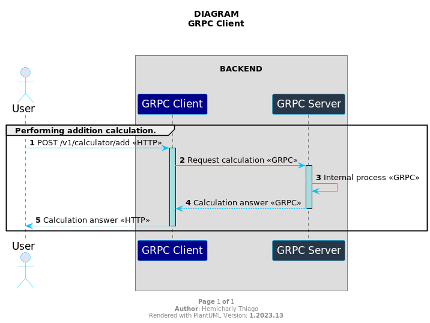
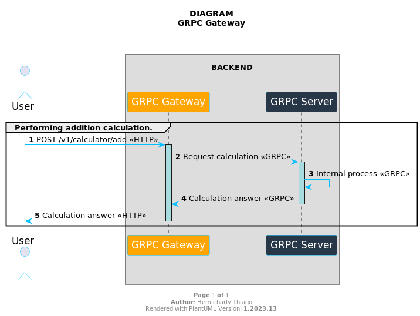

# GRPC SPRING BOOT 3.3.x


This educational project's main objective is to understand how gRPC works in conjunction with Spring Boot. We developed a simple calculator example, focusing on core functionality, and chose to use the latest versions of dependencies to ensure compatibility and explore the latest features available.

Throughout the development process, we pay special attention to error handling to increase the robustness of the system. We explore effective strategies for dealing with unexpected situations, ensuring a more reliable user experience. Furthermore, we highlight that gRPC was implemented in Go Lang, emphasizing the performance and efficiency of this language in building distributed services.

By implementing detailed log tracking across applications, we provide a clearer, more granular view of the execution flow. The integration of gRPC with Spring Boot in Go Lang was carried out comprehensively, highlighting not only the effectiveness of gRPC, but also the conscious choice of the Go language for this purpose.

By sharing this knowledge, we hope to provide valuable insights into best practices in integrating gRPC with Spring Boot, especially when implemented in Go Lang. This approach aims to help developers looking to improve their distributed communication skills, highlighting the efficiency and flexibility provided by this specific combination of technologies.


## Keywords
*Keywords*: gRPC, Gateway, Gateway-Api, Spring Boot 3, Java 17, Micrometer, Tracer, RESTFul, Microservices, Docker, Docker Compose.


### 1. Required requirements

- Install Java 21
- Install Maven 3.6.3
- Go Lang 1.23.3
- Install Docker
- Install Docker Compose
- Makefile


### 2. Running the applications

#### 2.1. GRPC Client consumer GRPC Server with java

  

##### 2.1.1. Steps:

* install dependencies

    ```bash
    mvn clean install
    ```

* grpc-server

    ```bash
    cd grpc-server
    mvn spring-boot:run
    ```

* grpc-client

    ```bash
    cd grpc-client
    mvn spring-boot:run
    ```

* start with docker (**Optional**)

  * Need to create an external network.
  ```bash
  make create-network
  ```
  
  * Start container
  ```bash
  make container-start
  ```


##### 2.1.2. GRPC Client Documentation

  * grpc-client
    * [doc-api](http://localhost:8082/swagger-doc/api)
    * [swagger-ui](http://localhost:8082/swagger-doc/index.html)
    * [actuator](http://localhost:8082/actuator)

  * grpc-server
    * [actuator](http://localhost:8081/actuator)
    * Check out the list of current gRPC tools at [awesome-grpc](https://github.com/grpc-ecosystem/awesome-grpc#tools)

  * Reference
    * What is gRPC [guide](https://grpc.io/docs/guides/)


    
#### 2.2. GRPC Gateway-Api consumer GRPC Server with Go Lang

  

##### 2.2.1. Steps:

**NOTE**: The grpc-server server needs to be running with docker container

* container-grpc-server

    ```bash
    make container-grpc-server
    ```

* generate-pb

    ```bash
    make generate-pb
    ```

* go-mod-tidy

    ```bash
    make go-mod-tidy
    ```

* container-grpc-gateway

    ```bash
    make container-grpc-gateway
    ```

##### 2.2.2. GRPC Gateway-Api Documentation:

* Example curl:

    ```bash
    curl --location 'http://0.0.0.0:8085/v1/calculator/add' \
    --header 'Content-Type: application/json' \
    --header 'Accept: application/json' \
    --data '{
        "num1": 1,
        "num2": 5
    }'
    ```
   **NOTE**: Status code 200 with response body:
    ```
    {
       "result": 6
    }  
    ```

* Reference
    * What is gRPC Gateway [guide](https://grpc-ecosystem.github.io/grpc-gateway/)


### 3. Suggestions and Contributions Are Welcome! 🌟

If you have ideas, suggestions, or come across something that could be improved, please feel free to share!

#### How You Can Contribute:

1. **Suggest Enhancements**: Open an issue to discuss ideas and improvements. We want to hear what you think can make the project even more amazing.
2. **Report Issues**: Found a bug or something not working as expected? Open an issue describing the problem, and we'll be happy to address it.
3. **Contribute Code**: If you're a developer and want to contribute code, we'd love to review your pull requests. Follow our contribution guidelines to make the process smooth.

**Thanks in Advance for Your Amazing Contributions!** 🙌

If you have any questions or need assistance, don't hesitate to reach out.

Cheers,
*Hemicharly Thiago*